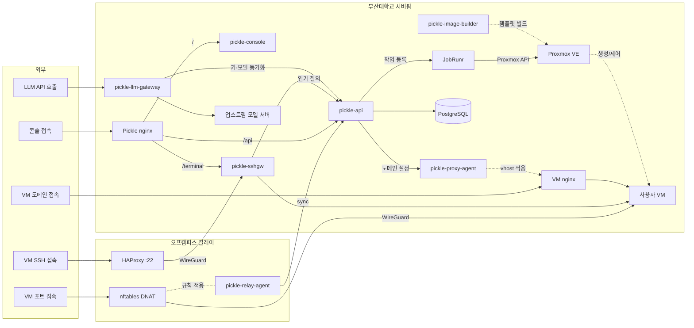

# pickle-relay-agent

부산대학교 클라우드 플랫폼(Pickle)의 오프캠퍼스 릴레이에서 nftables DNAT을 제어하는
에이전트입니다.

캠퍼스 방화벽이 인바운드를 막기 때문에, 사용자 포트는 오프캠퍼스 릴레이 호스트가 대신
받아 캠퍼스가 아웃바운드로 개통한 WireGuard 터널로 VM까지 넘깁니다. 이 에이전트는 그
릴레이 호스트에서 돌아갑니다.

```
인터넷 ──공인 포트──▶ 릴레이 호스트 nftables DNAT ──WireGuard──▶ 캠퍼스 ──▶ 사용자 VM
                            ▲ netlink
                       relay-agent ── 매핑 스냅샷(JSON, generation) 조회 ──▶ 플랫폼 API
```

에이전트는 스냅샷을 만들지 않고 가져오기만 합니다. 무엇을 열지는 플랫폼이 정합니다.
매 주기 플랫폼 API에 적용 상태와 사용량을 보고하고, 바뀐 스냅샷이 내려오면 반영합니다.
로컬 파일을 소스로 사용하는 모드는 부트스트랩과 테스트용입니다.

## 주요 기능

플랫폼은 VM 신청·승인·생성, SSH와 웹 터미널 접속, 도메인 공개, 만료와
삭제까지를 다룹니다. 이 레포지토리가 맡는 부분은 아래와 같습니다.

- **매핑 수렴**: 플랫폼이 정한 공인 포트에서 VM 포트로 가는 매핑을 릴레이 호스트의
  방화벽에 반영합니다.
- **원자 교체**: 적용할 때마다 자기 규칙 전체를 한 번에 바꾸므로 절반만 반영된 상태가
  생기지 않습니다.
- **남용 가드**: 매핑마다 동시 연결 수와 신규 연결 속도에 상한을 두어, 한 매핑에 몰린
  트래픽이 다른 접속 경로를 밀어내지 못하게 합니다.
- **입력 재검증**: 받은 스냅샷을 그대로 믿지 않고 대상 대역과 공인 대역, 중복 여부를
  매번 다시 확인합니다.
- **오래된 상태 폐기**: 보존한 스냅샷이 허용 창을 넘기면 버리고 빈 집합으로 수렴합니다.
- **사용량 보고** — 매핑별 연결 수와 트래픽, 가드가 막은 횟수를 집계해 플랫폼에 보고합니다.
- **부팅 복구**: 릴레이가 재시작해도 마지막 상태를 다시 적용해 매핑이 살아납니다.

## 동작 방식

- **소유 범위** — `ip pickle_relay_dnat` 하나만 만들고 교체합니다. 룰셋
  전체 flush는 코드에 없습니다. 정적 배관 테이블은 호스트 부팅 설정이 소유합니다.
- **적용은 원자적입니다.** 테이블 삭제, 재생성, 전체 규칙을 단일 netlink 배치로
  커밋합니다. 이전 규칙 전체이거나 새 규칙 전체이거나 둘 중 하나입니다.
- **실패하면 세대를 올리지 않습니다.** 보고 세대를 그대로 두고 다음 주기에 재시도합니다.
- **입력을 매번 검증합니다.** 모든 값을 타입 파싱(`netip.Addr`, 포트 정수)하고 대상
  CIDR 화이트리스트, 공인 포트 대역, 중복 여부를 매 로드마다 다시 확인합니다.
- **fail-open에 경계가 있습니다.** 마지막 적용 스냅샷을 보존해 두고 부팅 때
  재적용합니다. 나이가 허용 창을 넘겼으면 폐기하고 빈 집합으로 수렴합니다. 회수된 IP가
  그 사이 다른 사용자에게 재할당됐을 수 있기 때문입니다. 허용 창은 플랫폼의 IP 격리
  창과 같은 값으로 둡니다. 부팅 재적용이 실패하면 종료하지 않고 폴링 루프로 들어갑니다.
  종료하면 서비스가 몇 초마다 재시작을 반복하면서, 정작 원인을 실어 나르는 동기화
  보고가 한 번도 올라가지 못하기 때문입니다. 적용이 성공하지 않았으므로 세대는 계속
  0으로 보고하고, 주기마다 빈 집합 수렴을 다시 시도합니다.
- **netlink 직접 호출** — `nft(8)`를 실행하지 않아 자식 프로세스가 없고, systemd
  유닛이 `SystemCallFilter=@system-service`와 `MemoryDenyWriteExecute=yes`를 켠 채
  돌아갑니다. exec 헬퍼를 추가한다면 이 하드닝 블록부터 다시 봐야 합니다.
- **방화벽을 결정하는 값에는 기본값이 없습니다.** 대상 CIDR, 공인 대역, 인터페이스,
  스냅샷 허용 창은 없으면 기동을 거부합니다.

## 스냅샷 형식

sync 응답 본문, `apply` 입력 파일, 보존 파일이 모두 같은 형태입니다. 예시는 문서화
대역(RFC 5737) 주소를 사용합니다.

```json
{ "generation": 42,
  "mappings": [
    { "id": 101, "proto": "tcp", "publicPort": 12345,
      "targetAddr": "192.0.2.23", "targetPort": 8080 } ] }
```

`proto`는 `tcp` 또는 `udp`입니다. `publicPort`는 릴레이 예약 대역 안이어야 하고 대역
하한은 1024입니다. `targetAddr`는 화이트리스트 CIDR 안의 IPv4이며, 같은
(proto, publicPort) 중복은 허용하지 않습니다. 정지된 매핑은 스냅샷에서 빠진 채로
내려옵니다.

매핑에는 가드 상한 필드 `ctMax`, `newConnRate`, `newConnBurst`, `perSourceRate`,
`perSourceBurst`를 선택적으로 담을 수 있습니다. 필드를 생략하면 릴레이의 환경 변수
기본값을 사용하고, `0`이면 그 매핑에서 해당 가드를 끄며, 그 외 값이면 기본값을
대체합니다. 버스트 필드는 짝이 되는 rate 필드가 0이 아닌 값으로 함께 와야 하고, 다섯
필드 모두 1,000,000 이하여야 합니다. 커널이 거부하는 값은 규칙 교체 배치 전체를
실패시키면서 어느 매핑 탓인지 알려주지 않으므로, 상한을 넘는 값은 매핑 id가 붙은
검증 오류로 미리 되돌려 보냅니다.

## 동기화

동기화는 단일 엔드포인트에 대한 HTTP 폴링입니다. 요청 하나가 보고와 조회를 겸합니다.

```
POST {PICKLE_RELAY_SYNC_URL}
Authorization: Bearer {PICKLE_RELAY_SYNC_TOKEN}

{ "appliedGeneration": 41, "agentVersion": "v1.2.0",
  "lastError":  [ { "mappingId": 101, "message": "..." } ],
  "counters":   [ { "mappingId": 101, "newConns": 12, "inPackets": 340, "inBytes": 51200,
                    "outPackets": 300, "outBytes": 48000,
                    "rateDropped": 0, "connDropped": 0, "perSourceDropped": 7 } ] }
```

응답은 두 형태입니다. 변경이 없으면 `{ "generation": 41 }`만 내려오고, 바뀌었으면
`{ "generation": 42, "mappings": [...] }` 전체 스냅샷이 내려옵니다. 매핑이 없는
응답의 generation이 보고한 적용 세대와 다르면 프로토콜 위반으로 보고 아무것도
적용하지 않습니다.

- **응답 파싱은 엄격합니다.** 모르는 필드가 있으면 스냅샷 전체를 거부합니다. 그래서
  응답에 필드를 추가하기 전에 에이전트를 먼저 업그레이드하는 것이 명세 규칙입니다.
- **counters는 기동 이후 누적값입니다.** 에이전트가 재시작하면 0부터 다시 시작하므로,
  서버는 값이 줄어든 것을 재시작으로 처리합니다.
- **counters는 보고 한 건당 최대 2000행**입니다. 살아 있는 매핑이 그보다 많으면 보고가
  직전 보고의 마지막 매핑 다음부터 이어 담고 끝에서 앞으로 돌아오므로, 모든 매핑이
  몇 회 안에 한 번씩 실립니다. 값이 누적이라 건너뛴 회차의 증가분도 다음 보고에 그대로
  들어갑니다. 요청 본문 상한(1 MiB)을 넘겨 동기화 자체가 막히는 일을 막는 장치입니다.
- **lastError는 최대 8건**, 메시지는 제어 문자를 제거하고 1024바이트로 잘라 보냅니다.
- 요청 타임아웃은 4초로, 최소 폴링 주기(5초)보다 짧게 두어 주기가 겹치지 않습니다.

다운그레이드 주의: 가드 상한 필드가 담긴 보존 스냅샷은 이 필드를 모르는 구버전
바이너리의 부팅 재적용에서 거부되어 빈 상태로 수렴합니다(fail-closed). 동기화 응답에도
같은 필드가 들어 있는 동안은 그 역시 거부되므로, 상한 필드를 사용하는 릴레이의
포워딩은 구버전으로 되돌리는 순간 끊깁니다.

## 남용 가드

매핑마다 세 겹의 상한이 붙습니다. 출발지 IP당 신규 연결 rate limit, 매핑 전체의 신규
연결 rate limit, 그리고 `ct count`(동시 연결 상한)입니다. 기본값은 모두 조이는
방향(drop 상한)만 있어 방화벽을 넓히지 않습니다. 스냅샷의 매핑별 상한 필드는
기본값을 넓히는 쪽으로도 대체할 수 있는데, 무엇을 열지 정하는 곳과 같은 인증된
플랫폼이 내려주는 값이기 때문입니다.

출발지별 가드는 매핑마다 동적 셋(원소 60초 만료, 최대 4096 출발지)에 IP별 토큰
버킷을 얹은 것으로, 한 출발지의 폭주가 매핑 전체의 버킷을 비워 다른 사용자까지
막는 일을 줄입니다. 셋이 가득 차면 새 출발지는 매핑 전체 가드로 넘어갑니다. 규칙
순서는 출발지별 → 전체 rate → `ct count` → DNAT입니다.

매핑마다 이름 있는 counter 여섯 개(신규 연결, 방향별 트래픽 두 개, 가드별 드롭 세
개)를 만들어 동기화 보고의 근거로 사용합니다. 트래픽 counter는 별도 forward 체인에
있는데, NAT 체인은 흐름의 첫 패킷만 보므로 바이트 집계가 거기서는 불가능하기
때문입니다. forward 체인은 집계만 하고 어떤 패킷도 막지 않습니다. 규칙 교체 때
counter가 0으로 돌아가는 것은 에이전트가 누적으로 보정해 보고합니다.

`ct count`가 세는 것은 살아 있는 연결이 아니라 conntrack 엔트리 수이고 TIME_WAIT도
포함합니다. 그래서 매핑당 정상 지속 한도는 대략 `상한 ÷ TIME_WAIT 수명`입니다. 릴레이는
순수 NAT 포워더라 TIME_WAIT를 30초로 두고 있어, 기본 상한 512에서 매핑당 초당 17연결
정도를 견딥니다. 짧은 연결이 잦은 서비스를 얹는다면 이 값을 기준으로 상한을 올려야 합니다.

`NEW_CONN_BURST=0`은 "버스트 없음"이 아니라 커널이 5패킷 허용치로 보정하는 값입니다.
대역에 릴레이 자체 서비스 포트가 들어 있으면 기동을 거부합니다. 가드 규칙에는 counter를
붙여 드롭이 관측되므로, 정상 트래픽 오탐과 실제 차단을 구분할 수 있습니다.

## 시작하기

```
scripts/build.sh        # dist/relay-agent (정적, CGO 없음)
scripts/verify.sh       # shellcheck + gofmt/vet/build/test + 공개 위생 검사
```

실행 모드는 둘입니다.

```
relay-agent apply -file snapshot.json   # 1회 적용 + 보존
relay-agent run                         # 부팅 재적용 → 폴링 루프
```

규칙 생성과 커널 커밋이 나뉘어 있어, 스냅샷에서 만들어지는 규칙 자체는 실제 커널 없이
검증합니다.

Go 1.26이 필요하고 직접 의존성은 `github.com/google/nftables` v0.3.0 하나입니다.
`scripts/systemd/relay-agent.service`는 전용 사용자 `pickle-relay`에
`AmbientCapabilities=CAP_NET_ADMIN`만 부여합니다.

## 구성

| 변수 | 필수 | 설명 |
|---|---|---|
| `PICKLE_RELAY_TARGET_CIDR` | ✔ | DNAT 대상 화이트리스트 CIDR (IPv4) |
| `PICKLE_RELAY_PUBLIC_BAND` | ✔ | 공인 포트 대역 `MIN-MAX` |
| `PICKLE_RELAY_PUBLIC_IFACE` | ✔ | DNAT을 걸 공인 인터페이스 |
| `PICKLE_RELAY_SNAPSHOT_MAX_AGE_HOURS` | ✔ | 부팅 재적용 허용 창. IP 격리 창에 맞춥니다 |
| `STATE_DIRECTORY` | ✔ | 보존 스냅샷 위치 (systemd `StateDirectory=` 주입) |
| `PICKLE_RELAY_SYNC_URL` | | 플랫폼 동기화 엔드포인트 (http/https 전체 URL) |
| `PICKLE_RELAY_SYNC_TOKEN` | | 릴레이 전용 Bearer 토큰. URL과 반드시 함께 설정합니다 |
| `PICKLE_RELAY_SOURCE_FILE` | | 파일 소스 경로. `SYNC_URL`과 동시에 설정할 수 없습니다 |
| `PICKLE_RELAY_POLL_SECONDS` | | 폴링 주기 (기본 15) |
| `PICKLE_RELAY_CT_MAX_PER_MAPPING` | | 매핑당 conntrack 상한 (기본 512, `0`이면 끔) |
| `PICKLE_RELAY_NEW_CONN_RATE` / `_BURST` | | 매핑당 신규 연결 pps 상한과 버스트 (기본 200/400) |
| `PICKLE_RELAY_PER_SOURCE_RATE` / `_BURST` | | 출발지 IP당 신규 연결 pps 상한과 버스트 (기본 50/100, rate `0`이면 끔) |

배포 값은 `/etc/pickle/relay-agent.env`(root 640)에 둡니다. 이 레포지토리에는 없습니다.

## 전체 아키텍처

<!-- arch:begin -->


| 레포지토리 | 역할 |
|---|---|
| [pickle-api](https://github.com/PNUops/pickle-api) | REST API와 프로비저닝 워커 (Spring Boot 4, Java 25, PostgreSQL 18, JobRunr) |
| [pickle-console](https://github.com/PNUops/pickle-console) | 사용자·관리자 웹 콘솔 (React 19, TypeScript) |
| [pickle-sshgw](https://github.com/PNUops/pickle-sshgw) | SSH 게이트웨이와 웹 터미널 브리지 (sshpiperd, Go) |
| [pickle-proxy-agent](https://github.com/PNUops/pickle-proxy-agent) | nginx 리버스 프록시 제어 에이전트 (Go) |
| [pickle-relay-agent](https://github.com/PNUops/pickle-relay-agent) | 오프캠퍼스 릴레이의 nftables DNAT 에이전트 (Go) |
| [pickle-llm-gateway](https://github.com/PNUops/pickle-llm-gateway) | 교내 LLM API 게이트웨이 (Go) |
| [pickle-image-builder](https://github.com/PNUops/pickle-image-builder) | 사용자 VM OS 이미지 빌드 레시피 (shell, virt-customize) |
| [pickle-infra](https://github.com/PNUops/pickle-infra) (비공개) | 인프라 프로비저닝 스크립트와 운영 런북 (shell) |
| [pickle-infra-example](https://github.com/PNUops/pickle-infra-example) | 프로비저닝·배포 스크립트와 런북 샘플 |
| [pickle-secrets](https://github.com/PNUops/pickle-secrets) (비공개) | 호스트 시크릿 볼트 (git-crypt) |
| [pickle-secrets-example](https://github.com/PNUops/pickle-secrets-example) | 볼트 레이아웃과 git-crypt 운용 절차 |
<!-- arch:end -->
